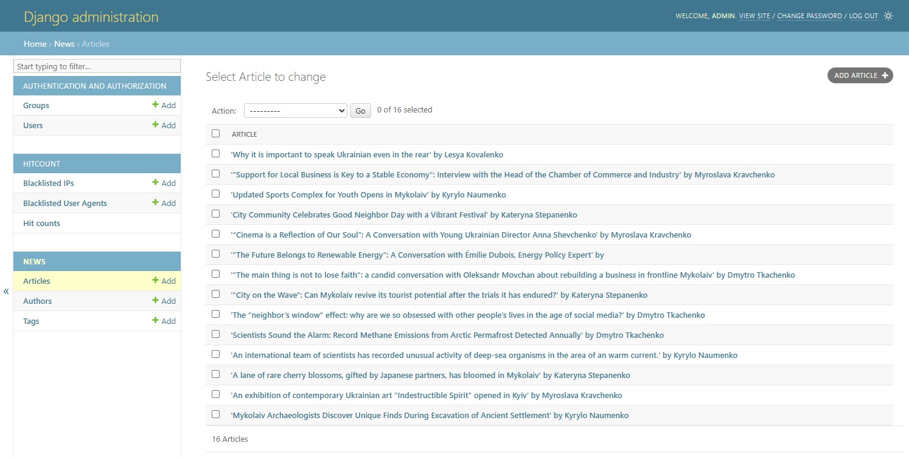

# Vazhlyvo-News

📄 Цей README.md доступний: [**Українською 🇺🇦**](README.md)

Vazhlyvo-News is a news website built with Django, aimed at providing users with a convenient interface to read up-to-date content. The project supports three types of articles and allows quick access to content in both Ukrainian and English.

## 🛠️ Technologies Used

- Python
- Django
- MySQL
- Redis
- HTML
- CSS
- JavaScript
- Bootstrap

## 🖼️ Interface Examples

### 📍 Homepage


### 📰 Article Page


### 🔍 Search Page


### 🧑‍💼 Admin Panel



## 🚀 Features

### 🌍 Language Support

- Full bilingual support: Ukrainian and English.
- Interface translated using `.po` files.
- Model field translations via **django-modeltranslation**.

### 📝 Content Management

- CMS based on **Django Admin**.
- Integration with **CKEditor 5** for article editing.
- User group permissions for role-based access control.

### 🔎 Search and Navigation

- Search by title and date range.
- Each article type has its own section.
- Pagination for article lists.

### ⚡ Performance and Optimization

- **Redis** based caching.
- **Debug Toolbar** integration for debugging.

### 📊 Analytics and Popularity

- Article view counter (**django-hitcount**).
- Popular articles shown on the homepage.
- Recommendation system based on tags.

### 🧩 Content Structure

- Categories supported: `news`, `column`, `interview`.
- Informers and latest posts section on the homepage.
- Dedicated author profile pages.

### 📱 Responsiveness

- Fully responsive layout using **Bootstrap 5**.

## ⚙️ Installation & Launch

```bash
# 1. Clone the repository
git clone https://github.com/Harynets/vazhlyvo-news.git
cd vazhlyvo-news

# 2. Create and activate a virtual environment
python -m venv venv
source venv/bin/activate  # On Windows: venv\Scripts\activate

# 3. Install dependencies
pip install -r requirements.txt

# 4. Create a .env file inside vazhlyvo-news/vazhlyvo
```

### .env (example):

```env
DJANGO_SECRET_KEY=your_secret_key
DATABASE_NAME=your_db_name
DATABASE_USERNAME=your_username
DATABASE_PASSWORD=your_password
```

```bash
# 5. Run migrations
python manage.py makemigrations
python manage.py migrate

# 6. Create a superuser
python manage.py createsuperuser

# 7. Start Redis (via Docker or WSL on Windows)

# 8. Run the development server
python manage.py runserver
```