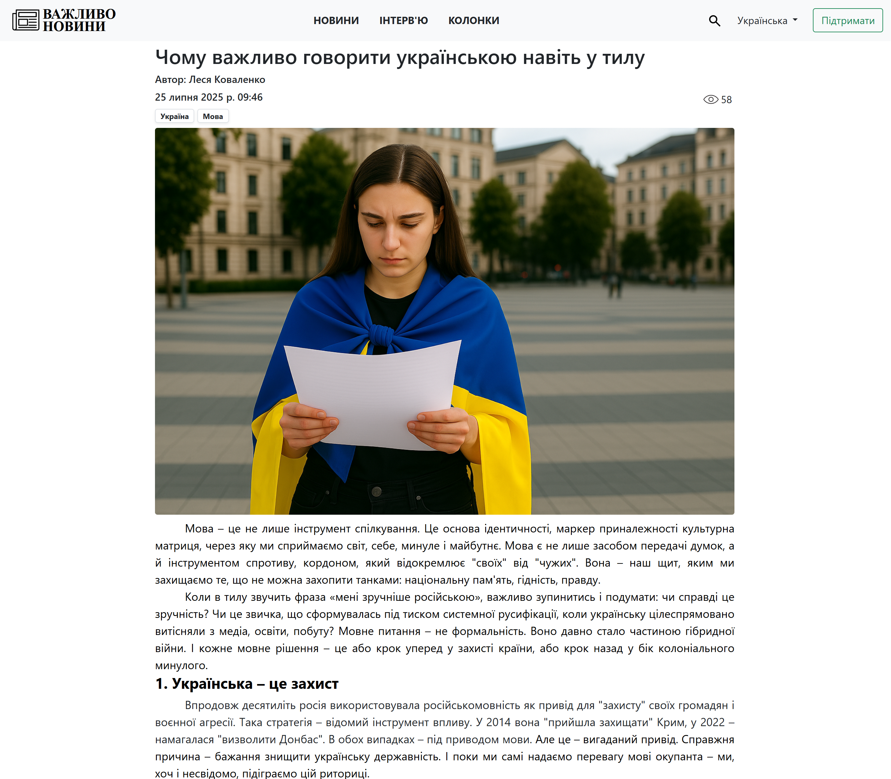
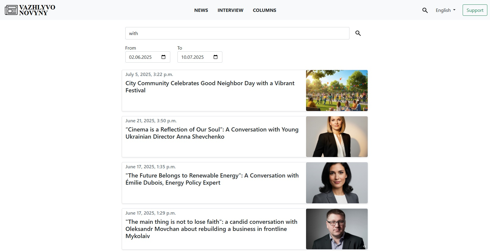
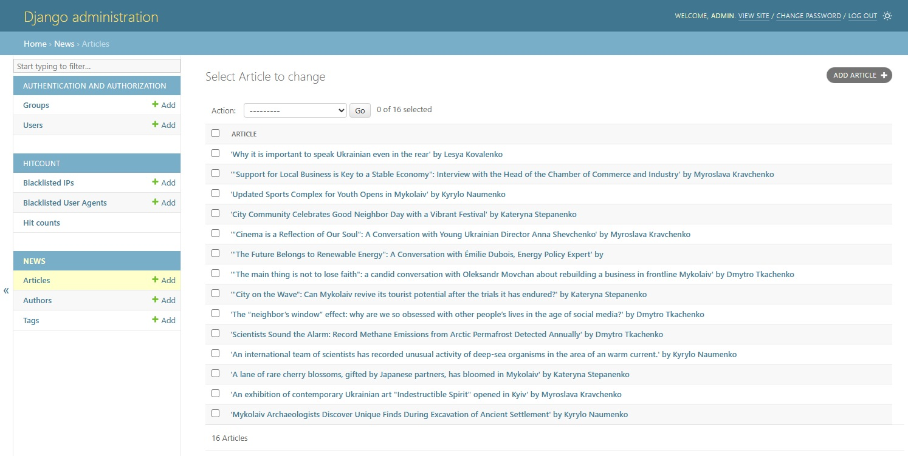

# Vazhlyvo-News

📄 This README is available in: [**English 🇬🇧**](README.en.md)

Vazhlyvo-News – новинний вебсайт, розроблений на Django. Його мета – надати користувачам зручний інтерфейс для перегляду актуальних новин. Проєкт підтримує три типи статей, та забезпечує можливість швидко знаходити та читати контент українською та англійською мовами.

## 🛠️ Використані технології

- Python
- Django
- MySQL
- Redis
- HTML
- CSS
- JavaScript
- Bootstrap

## 🖼️ Приклади інтерфейсу

### 📍 Головна сторінка


### 📰 Сторінка статті



### 🔍 Сторінка пошуку



### 🧑‍💼 Адмін-панель



## 🚀 Функціонал

### 🌍 Мовна підтримка
- Повна підтримка двох мов: української та англійської.
- Переклад інтерфейсу через `.po` файли.
- Переклад моделей за допомогою **django-modeltranslation**.

### 📝 Управління контентом
- CMS з використанням **Django Admin**.
- Підтримка **CKEditor 5** для зручного написання статей.
- Система прав доступу з гарантією безпеки.

### 🔎 Пошук і навігація
- Пошук статей за заголовком та часовим проміжком.
- Кожен тип статті має окремий розділ.
- Пагінація списків статей.

### ⚡ Швидкість і оптимізація
- Кешування на основі **Redis**.
- **Debug Toolbar** для відлагодження застосунку.

### 📊 Популярність та аналітика
- Лічильник переглядів статей (**django-hitcount**).
- Відображення популярних статей на головній.
- Система рекомендацій на основі тегів.

### 🧩 Структура контенту
- Підтримка категорій: `news`, `column`, `interview`.
- Інформери + блок останніх статей на головній сторінці.
- Окрема сторінка з усіма публікаціями авторів.

### 📱 Адаптивність
- **Bootstrap 5**: адаптивна, зручна структура сторінки.

## ⚙️ Встановлення і запуск

```bash
# 1. Клонувати репозиторій
git clone https://github.com/Harynets/vazhlyvo-news.git
cd vazhlyvo-news

# 2. Створити і активувати віртуальне середовище
python -m venv venv
source venv/bin/activate  # On Windows: venv\Scripts\activate

# 3. Встановити залежності
pip install -r requirements.txt

# 4. Створити .env та розмістити у vazhlyvo-news\vazhlyvo
```

### .env (приклад):
```env
DJANGO_SECRET_KEY=your_secret_key
DATABASE_NAME=your_db_name
DATABASE_USERNAME=your_username
DATABASE_PASSWORD=your_password
```

```bash
# 5. Створити міграції
python manage.py makemigrations
python manage.py migrate

# 6. Створити суперкористувача
python manage.py createsuperuser

# 7. Запустити Redis (можна через Docker або WSL на Windows)

# 8. Запустити сервер
python manage.py runserver
```